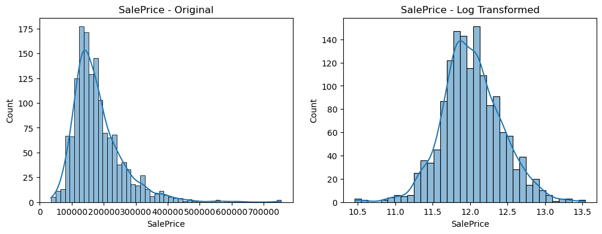
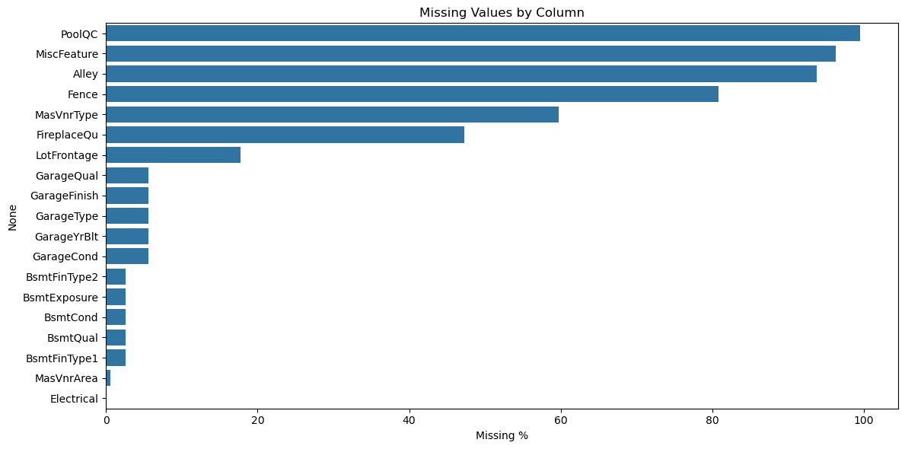
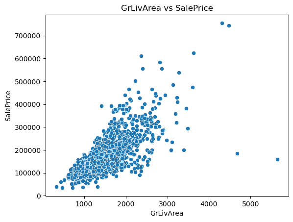
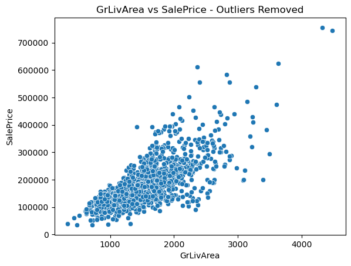

# House-Prices

## კონკურსის მოკლე მიმოხილვა

მოცემული გვაქვს კონკრეტული ფიჩერები სახლის შესახებ და უნდა დავაფრედიქთოთ სახლის ფასი.
შეფასება ხდება RMSE(Root-Mean-Squared-Error) მეთოდით, იმისთვის რომ მაღალ და დაბალ ფასებზე აცდენა ერთნაირად ახდენდეს გავლენას შედეგებზე.

## ჩემი მიდგომა

1. EDA - მონაცემებში პრობლემების პოვნა
2. Cleaning - null-ების მოშორება, თაიფების გასწორება, one-hot encoding
3. Feature Engineering - ახალი, უფრო გამოსადეგი სვეტების შექმნა
4. Feature Selection - ზედმეტი ცვლადების გადაგდება
5. Training - კონკრეტული მოდელებში(linear regression, random forest, xgBoost) საუკეთესო ჰიპერპარამეტრების და მოდელის შერჩევა

## რეპოზიტორიის სტრუქტურა

data ფოლდერში არის კეგლიდან წამოღებული მონაცემები და ჩემი საბმიშენი.
model_experiment-ში Cleaning, Feature Engineering, Feature Selection და Training.
model_inference-ში საუკეთესო მოდელის ჩამოტვირთვა და მის მიხედვით საბმიშენის შექმნა.
დანარჩენი რამდენიმე სურათია რომლებსაც ამ ფაილში ვიყენებ

# Cleaning
SalePrice გადახრილია, შესაბამისად მისი ლოგარითმი ავიღოთ და მასზე ვიმუშაოთ. საბოლოოდ, ფრედიქშენების გაკეთებისას შევაბრუნებთ.

ნალების პროცენტი თითოეული ფიჩერისთვის:

ტოპ 6-ისთვის ნალები უბრალოდ ნიშნავს კონკრეტული რაღაცის არ ქონას და არა იმას რომ შესაბამისი მონაცემი უცნობია.
LotFrontage არის ის ფიჩერი რომელშიც ყველაზე დიდი % გვაქვს მართლა missing,
რაც არის დაახლოებით 18%, რაც დაბალია, ანუ არცერთ სვეტს არ დავდროპავს missing value-ების გამო.

ახლა, უნდა შევავსოთ ყველა missing value data_description.txt-ის მიხედვით.

'LotFrontage', 'Electrical'-ში ნალები შეივსო სხვა სახლების მონაცემების მიხედვით.
'GarageYrBlt', 'MasVnrArea'-ში ნალები შეივსო 0-ებით.
დანარჩენებში, 'None'-ებით.

GrLivArea-ს აქვს 2 აშკარა აუთლაიერი ქვედა მარჯვენა კუთხეში რაც უნდა ამოვაგდოთ

# Feature Engineering

დავამატოთ გამოსადეგარი ფიჩერები:
- TotalSF
- HouseAge
- RemodAge
- WasRemodeled
- TotalBath
- HasGarage
- Has2ndFloor

['ExterQual', 'ExterCond', 'BsmtQual', 'BsmtCond',
             'HeatingQC', 'KitchenQual', 'FireplaceQu', 'GarageQual', 'GarageCond']
მოცემული ფიჩერები წარმოდგენილია შესაბამისად:
{'None', 'Po', 'Fa', 'TA', 'Gd', 'Ex'}
სადაც მარცნიდან მარჯვნივ იზრდება ხარისხი.
შესაბამისად, სჯობს რომ ისინი რიცხვებით შევცვალოთ ისე რომ უარესს უფრო დაბალი მივანიჭოთ და უკეთესს მაღალი.

ამის შემდეგ, ლნ მოვდოთ იმ ფიჩერებს რომელიც ზედმეტად გადახრილია და ბოლოს ვქნათ one-hot encoding.

# Feature Selection

## კორელაციის ფილტრი

წავშალოთ ფიჩერები რომელსაც ზედმეტად დაბალი კორელაცია აქვს SalePrice-თან.
სავარაუდო ზღვრები: 0, 0.05, 0.1, 0.15, 0.2.
Ridge მოდელით და 5-fold ვალიდაციით საუკეთესო შედეგი შეუცვლელმა დეითასეტმა მოგვცა.

წავშალოთ ფიჩერები რომლებსაც ზედმეტად მაღალი კორელაცია აქვთ ერთმანეთთან.
სავარაუდო ზღვრები: 0.8, 0.85, 0.9, 0.95, 1.
იგივე მოდელით საუკეთესო შედეგი არის 0.85-ზე.
ამან დაგვიტოვა 209 ფიჩერი.

# RFE

იგივე მოდელით ჩავატაროთ RFE.
შედეგად დაგვრჩა 207 ფიჩერი.

# Training

4 მოდელი დავატრეინე და შევაფასე: Linear Regression, Ridge, Random Forest, და XGBoost.
ყველა მოდელისთვის გამოვიყენე 80/20 თრეინ/ტესტ სპლიტი და
შევაფასე 5-fold cross validation RMSE-ით და გადადებულ სატესტო 20%-ზე RMSE-ით.
ჰიპერპარამეტრები შევარჩიე გრიდ სერჩით random forest-სა და xgBoost-ზე.
ყველა რანი დალოგილია 
[DagsHub](https://dagshub.com/lbegi23/House-Prices)-ზე.

## Model Comparison

| Model | Best Params | CV RMSE | Test RMSE |
|---|---|---|---|
| Linear Regression | - | 0.0099 | 0.0087 |
| Ridge | alpha=10 | 0.0092 | 0.0086 |
| Random Forest | max_depth=None, min_samples_split=2, n_estimators=300 | 0.0112 | 0.0092 |
| XGBoost | learning_rate=0.05, max_depth=3, n_estimators=300, subsample=0.8 | 0.0098 | 0.0084 |

## Hyperparameter Tuning

**Ridge** —     'alpha': [0.1, 1, 10, 50, 100]

**Random Forest** —     'n_estimators': [100, 300],
    'max_depth': [None, 10, 20],
    'min_samples_split': [2, 5]

**XGBoost** —     'n_estimators': [100, 300],
    'max_depth': [3, 5, 7],
    'learning_rate': [0.05, 0.1],
    'subsample': [0.8, 1.0]

## Results

XGBoost-მა აჩვენა საუკეთესო სატესტო შედეგი (0.0084) და ridge-მა აჩვენა საუკეთესო cv შედეგი (0.0092).
XGBoost აირჩა საუკეთესო მოდელად.

# შენიშვნა

SalePrice-ს შეცდომით ორჯერ მოვდე ლოგარითმი (ერთის ნაცვლად) და ისე დავატრეინე და გავტესტე ყველაფერი.
როცა გავასწორე, ყველა მოდელზე გაუარესდა შედეგი, მათ შორის კეგლის საბმიშენზეც.
ვერანაირ ლოგიკას ვერ ვხედავ ორჯერ რო ქონდეს ლოგარითმი მოდებული,
მაგრამ რადგან უკეთესად მუშაობს დავტოვე ასე...
